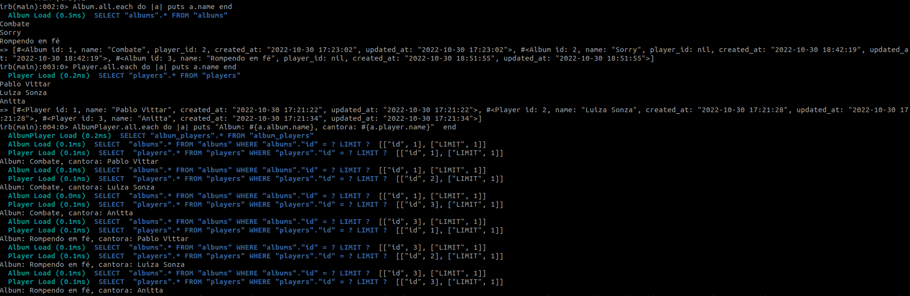

# 🚀  Desafio - Refactoring de relacionamento

> A Madonna resolveu lançar um album em parceria com a Shakira! E agora?!

Nosso PO jamais iria esperar que um album pudesse ter mais de um artista. Transforme a relacão 1 para N entre Player e Album em uma relação N para N. Precisamos de testes senão o chato do agilista vai brigar conosco!

## Setup

👋 Olá, para que você consiga executar esse projeto na sua máquina é necessária a instalação das seguintes dependências:
  
  - **🛠 Dependências**
    - ruby '2.4.2'
    - rails '5.2.6'


## Baixar o Projeto
```bash
git clone git@github.com:NathaliaC/ruby-dev-test-2.git
```

## Para executar o projeto e criar os modelos

Para instalar o ruby na sua máquina, você pode optar pela escolha de um gerenciador de versão da sua preferência, para esse teste foi utilizado o `asdf`.  
```bash
-> asdf install ruby 2.4.2
-> gem install bundler
-> bundle install
-> rake db:create
-> rake db:migrate
```
## Testes

Execute o comando abaixo na raiz do projeto
```bash
rspec
```
## Resultado

